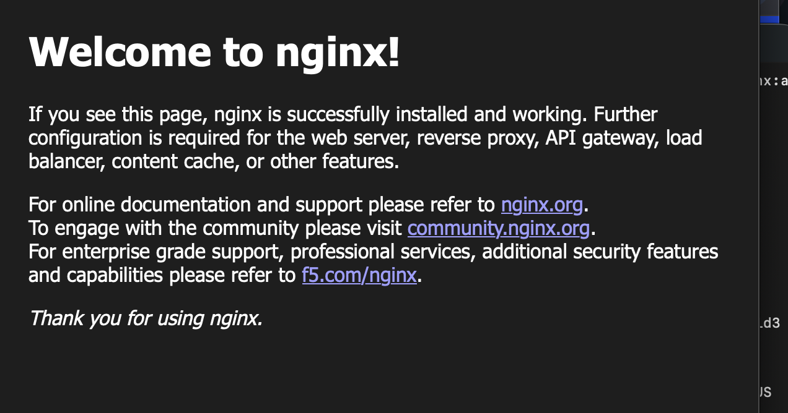

University: [ITMO University](https://itmo.ru/ru/)
Faculty: [FICT](https://fict.itmo.ru)
Course: [Введение в веб технологии](https://itmo-ict-faculty.github.io/introduction-in-web-tech/)
Year: 2026/2027
Group: 1
Author: Kuhi Arina
Lab: Lab1
Date of create: 07.09.2026
Date of finished:

# Лабораторная работа №1. Основы работы с Docker

## Цель работы

Получить базовые навыки работы с Docker: установить и проверить Docker, изучить работу с Docker-образами и контейнерами, запустить веб-сервер Nginx, освоить основные команды управления контейнерами и проверить сохранение данных с помощью Docker Volumes.

## Ход работы

### 1. Установка и проверка Docker

Для выполнения лабораторной работы был установлен Docker Desktop для macOS на компьютере с архитектурой Apple Silicon.

Архитектура компьютера была проверена командой:

```bash
uname -m
```

Результат:

```text
arm64
```

Версия Docker была проверена командой:

```bash
docker --version
```

Результат:

```text
Docker version 29.7.2, build a7dcaa6
```

Для проверки корректности установки был запущен тестовый контейнер:

```bash
docker run hello-world
```

В результате было получено сообщение:

```text
Hello from Docker!
This message shows that your installation appears to be working correctly.
```

Таким образом, Docker был успешно установлен и запущен.

---

### 2. Работа с Docker-образами и контейнерами

Для просмотра загруженных Docker-образов использовалась команда:

```bash
docker images
```

В списке присутствовал образ:

```text
hello-world:latest
```

Для просмотра работающих контейнеров была выполнена команда:

```bash
docker ps
```

Список был пуст, поскольку контейнер `hello-world` уже завершил выполнение.

Для просмотра всех контейнеров, включая завершённые, использовалась команда:

```bash
docker ps -a
```

Контейнер `hello-world` имел статус:

```text
Exited (0)
```

Код `0` означает успешное завершение процесса внутри контейнера.

Таким образом, была изучена разница между Docker-образом и Docker-контейнером.

Docker image представляет собой шаблон, содержащий приложение и необходимые зависимости, а Docker container является созданным на основе этого образа экземпляром, который может находиться в запущенном или остановленном состоянии.

---

### 3. Работа с Ubuntu-контейнером

Был загружен официальный образ Ubuntu:

```bash
docker pull ubuntu:latest
```

После этого был запущен интерактивный контейнер Ubuntu:

```bash
docker run -it ubuntu bash
```

После запуска командная строка изменилась:

```text
root@3c51d4f10b25:/#
```

Это означало, что дальнейшие команды выполнялись уже внутри Ubuntu-контейнера, а не в основной операционной системе macOS.

Для обновления списка доступных пакетов и установки утилиты `curl` была выполнена команда:

```bash
apt update && apt install -y curl
```

После установки версия `curl` была проверена командой:

```bash
curl --version
```

Результат:

```text
curl 8.18.0 (aarch64-unknown-linux-gnu)
```

Таким образом, внутри Docker-контейнера было успешно установлено дополнительное программное обеспечение.

Для выхода из контейнера использовалась команда:

```bash
exit
```

После выполнения команды управление вернулось в Terminal основной операционной системы macOS.

---

### 4. Запуск веб-сервера Nginx

Для запуска веб-сервера был создан контейнер на основе образа `nginx:alpine`:

```bash
docker run -d -p 8080:80 --name web-server nginx:alpine
```

В данной команде:

- `docker run` — создаёт и запускает контейнер;
- `-d` — запускает контейнер в фоновом режиме;
- `-p 8080:80` — перенаправляет порт `8080` основной системы на порт `80` внутри контейнера;
- `--name web-server` — задаёт контейнеру имя `web-server`;
- `nginx:alpine` — указывает используемый Docker-образ.

Работа контейнера была проверена командой:

```bash
docker ps
```

Контейнер `web-server` находился в состоянии `Up`.

Для проверки работы веб-сервера в браузере был открыт адрес:

```text
http://localhost:8080
```

В результате была отображена стандартная страница Nginx:

```text
Welcome to nginx!
```

Это подтвердило, что веб-сервер Nginx успешно работает внутри Docker-контейнера и доступен из основной операционной системы через порт `8080`.

Для просмотра журналов работающего контейнера была выполнена команда:

```bash
docker logs web-server
```

В логах присутствовал успешный HTTP-запрос:

```text
"GET / HTTP/1.1" 200
```

HTTP-код `200` означает, что запрос к веб-серверу был успешно обработан.

Для подключения непосредственно к работающему контейнеру использовалась команда:

```bash
docker exec -it web-server sh
```

После выполнения команды стало возможно выполнять команды непосредственно внутри контейнера Nginx.

---

### 5. Управление контейнерами

Для остановки работающего контейнера использовалась команда:

```bash
docker stop web-server
```

После остановки контейнер перестал отображаться при выполнении команды:

```bash
docker ps
```

Это связано с тем, что `docker ps` показывает только контейнеры, находящиеся в запущенном состоянии.

При этом остановленный контейнер продолжал отображаться при выполнении команды:

```bash
docker ps -a
```

Команда `docker ps -a` показывает все созданные контейнеры, включая остановленные.

Для повторного запуска существующего контейнера использовалась команда:

```bash
docker start web-server
```

После этого контейнер снова находился в состоянии `Up`.

Перед удалением контейнер был остановлен:

```bash
docker stop web-server
```

После этого контейнер был удалён командой:

```bash
docker rm web-server
```

Удаление контейнера не удаляет Docker-образ, из которого этот контейнер был создан.

Для просмотра существующих образов использовалась команда:

```bash
docker images
```

В списке продолжал присутствовать образ:

```text
nginx:alpine
```

Для удаления самого Docker-образа была выполнена команда:

```bash
docker rmi nginx:alpine
```

Docker подтвердил успешное удаление образа:

```text
Untagged: nginx:alpine
Deleted: sha256:72ba65eb42c10344912a84ff42408db7d34f2feb642204570ab8fc5ffd29f1d3
```

Таким образом, были изучены основные команды управления жизненным циклом Docker-контейнеров и Docker-образов.

Команда `docker stop` останавливает контейнер, но не удаляет его.

Команда `docker start` повторно запускает уже существующий остановленный контейнер.

Команда `docker rm` удаляет контейнер.

Команда `docker rmi` удаляет Docker-образ.

---

### 6. Работа с Docker Volumes

Для изучения постоянного хранения данных был создан Docker Volume:

```bash
docker volume create my-volume
```

Для просмотра существующих Docker Volumes использовалась команда:

```bash
docker volume ls
```

После этого был создан Ubuntu-контейнер с подключением тома `my-volume` к директории `/data` внутри контейнера:

```bash
docker run -it --name volume-test -d -v my-volume:/data ubuntu bash
```

Для подключения к контейнеру использовалась команда:

```bash
docker exec -it volume-test bash
```

Внутри контейнера был создан текстовый файл:

```bash
echo "Hello from volume" > /data/test.txt
```

Содержимое созданного файла было проверено командой:

```bash
cat /data/test.txt
```

Результат:

```text
Hello from volume
```

После этого первый контейнер был остановлен и удалён.

Затем был создан новый контейнер с подключением того же Docker Volume:

```bash
docker run -it --name volume-test-2 -d -v my-volume:/data ubuntu bash
```

Для подключения к новому контейнеру была выполнена команда:

```bash
docker exec -it volume-test-2 bash
```

После подключения к новому контейнеру было проверено содержимое ранее созданного файла:

```bash
cat /data/test.txt
```

Результат:

```text
Hello from volume
```

Таким образом, файл, созданный в первом контейнере, сохранился после его удаления и был доступен во втором контейнере.

Это подтверждает, что Docker Volume хранит данные независимо от жизненного цикла конкретного контейнера.

Docker Volumes позволяют сохранять данные отдельно от файловой системы контейнера и повторно подключать эти данные к другим контейнерам.

---

## Вывод

В ходе лабораторной работы были изучены основные возможности Docker.

Была выполнена установка Docker Desktop для macOS и проверена корректность его работы с помощью тестового контейнера `hello-world`.

Были изучены основные команды для просмотра Docker-образов и контейнеров: `docker images`, `docker ps` и `docker ps -a`.

Был загружен и запущен контейнер Ubuntu, внутри которого была установлена и проверена утилита `curl`.

Был запущен веб-сервер Nginx в Docker-контейнере с пробросом порта `8080` основной операционной системы на порт `80` контейнера. Работа веб-сервера была успешно проверена через браузер по адресу `http://localhost:8080`.

Также были изучены основные команды управления жизненным циклом контейнеров и образов: `docker run`, `docker stop`, `docker start`, `docker rm` и `docker rmi`.

В заключительной части лабораторной работы была изучена работа Docker Volumes. Было подтверждено, что данные, сохранённые в Docker Volume, не удаляются вместе с контейнером и могут быть доступны после подключения того же тома к новому контейнеру.

В результате выполнения лабораторной работы были получены практические навыки работы с Docker-образами, контейнерами, веб-серверами и постоянным хранением данных.

Цель лабораторной работы достигнута.
## Скриншот работы Nginx


