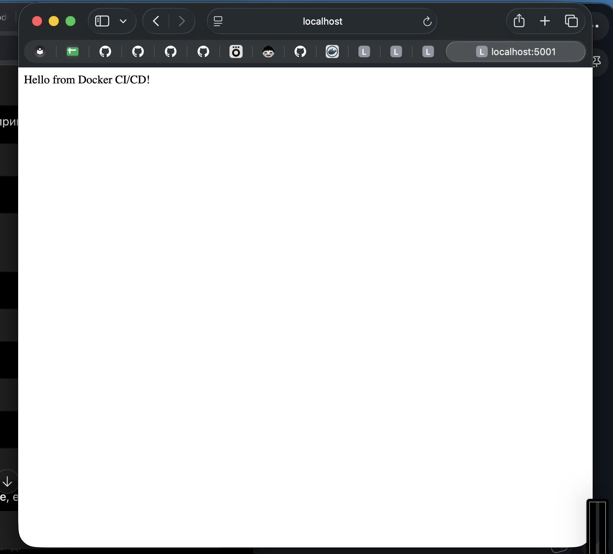
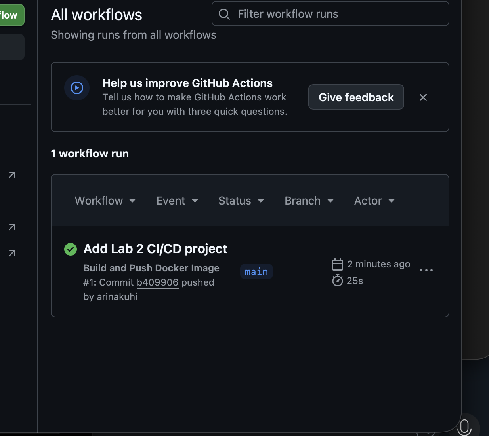
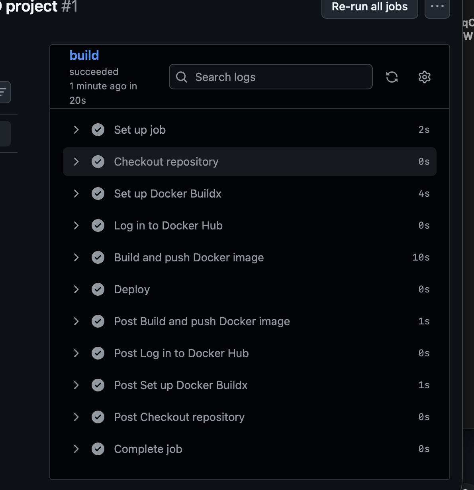
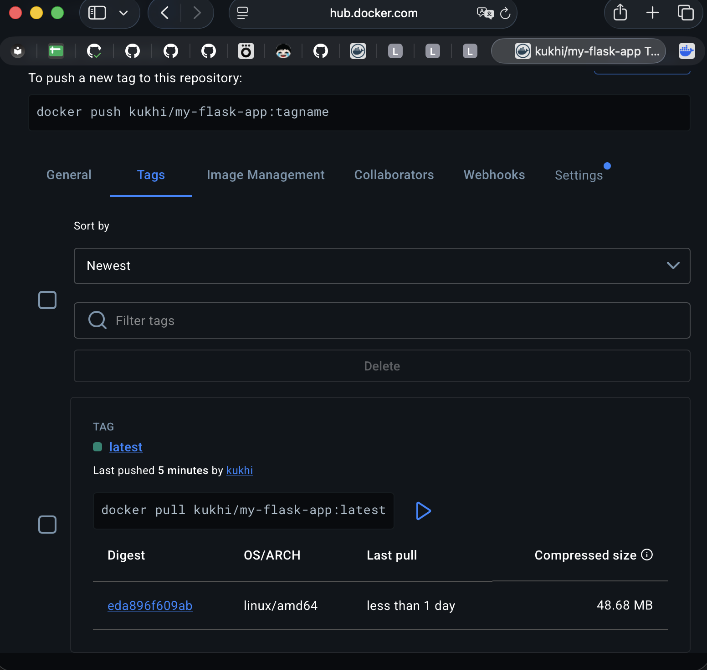

University: [ITMO University](https://itmo.ru/ru/)
Faculty: [FICT](https://fict.itmo.ru)
Course: [Введение в веб технологии](https://itmo-ict-faculty.github.io/introduction-in-web-tech/)
Year: 2026/2027
Group: 1
Author: Kuhi Arina
Lab: Lab2
Date of create: 08.09.2026
Date of finished:

# Лабораторная работа №2. CI/CD с использованием GitHub Actions и Docker Hub

## Цель работы

Получить практические навыки настройки CI/CD-процесса с использованием GitHub Actions и Docker Hub.

В рамках лабораторной работы необходимо было создать простое веб-приложение, подготовить Dockerfile, локально проверить сборку Docker-образа, настроить GitHub Actions для автоматической сборки и публикации Docker-образа в Docker Hub при выполнении `push` в ветку `main`.

## Ход работы

### 1. Создание Flask-приложения

Для лабораторной работы было создано простое веб-приложение на Flask.

Файл `app.py` содержит следующий код:

```python
from flask import Flask

app = Flask(__name__)

@app.route("/")
def hello():
    return "Hello from Docker CI/CD!"

if __name__ == "__main__":
    app.run(host="0.0.0.0", port=5000)
```

Приложение создаёт HTTP-сервер Flask, который принимает запросы на корневой маршрут `/` и возвращает текст:

```text
Hello from Docker CI/CD!
```

Параметр:

```python
host="0.0.0.0"
```

позволяет приложению принимать соединения со всех сетевых интерфейсов внутри Docker-контейнера.

Приложение работает на порту:

```text
5000
```

---

### 2. Создание файла requirements.txt

Для установки необходимых Python-зависимостей был создан файл:

```text
requirements.txt
```

Его содержимое:

```text
Flask==3.1.2
```

Этот файл используется при сборке Docker-образа для автоматической установки Flask.

---

### 3. Создание Dockerfile

Для контейнеризации приложения был создан файл `Dockerfile`:

```dockerfile
FROM python:3.13-slim

WORKDIR /app

COPY requirements.txt .
RUN pip install --no-cache-dir -r requirements.txt

COPY app.py .

EXPOSE 5000

CMD ["python", "app.py"]
```

В данном Dockerfile:

- `FROM python:3.13-slim` — задаёт базовый Docker-образ с Python;
- `WORKDIR /app` — устанавливает рабочую директорию `/app`;
- `COPY requirements.txt .` — копирует файл зависимостей внутрь Docker-образа;
- `RUN pip install --no-cache-dir -r requirements.txt` — устанавливает Python-зависимости;
- `COPY app.py .` — копирует Flask-приложение в образ;
- `EXPOSE 5000` — указывает, что приложение использует порт `5000`;
- `CMD ["python", "app.py"]` — задаёт команду запуска приложения при старте контейнера.

---

### 4. Локальная сборка Docker-образа

Перед настройкой CI/CD была выполнена локальная проверка Docker-образа.

Для сборки использовалась команда:

```bash
docker build -t lab2-flask ./lab2
```

После успешной сборки образ был проверен командой:

```bash
docker images
```

В списке Docker-образов появился образ:

```text
lab2-flask:latest
```

---

### 5. Локальный запуск контейнера

Для запуска Flask-приложения первоначально использовался порт `5000`.

Однако при запуске контейнера Docker сообщил:

```text
bind: address already in use
```

Это означало, что порт `5000` на основной системе macOS уже был занят другим процессом.

Для решения проблемы внешний порт был изменён на `5001`, при этом внутренний порт контейнера остался `5000`.

Контейнер был запущен командой:

```bash
docker run -d -p 5001:5000 --name lab2-flask-container lab2-flask
```

Параметр:

```text
5001:5000
```

означает:

```text
порт 5001 на macOS → порт 5000 внутри Docker-контейнера
```

После запуска контейнер был проверен командой:

```bash
docker ps
```

В результате было видно перенаправление портов:

```text
0.0.0.0:5001->5000/tcp
```

Работа приложения была проверена командой:

```bash
curl http://localhost:5001
```

Результат:

```text
Hello from Docker CI/CD!
```

Также приложение было открыто в браузере по адресу:

```text
http://localhost:5001
```

Результат работы приложения:



Таким образом, перед настройкой CI/CD было подтверждено, что Dockerfile и Flask-приложение работают корректно.

---

### 6. Создание репозитория в Docker Hub

Для хранения автоматически собранного Docker-образа был создан публичный репозиторий Docker Hub:

```text
kukhi/my-flask-app
```

Репозиторий используется GitHub Actions для публикации Docker-образа.

Для безопасной авторизации GitHub Actions в Docker Hub был создан Docker Hub Personal Access Token с правами чтения и записи.

Пароль Docker Hub напрямую в GitHub Actions не использовался.

---

### 7. Настройка GitHub Secrets

В настройках GitHub-репозитория были добавлены два Repository Secret:

```text
DOCKER_USERNAME
```

с Docker Hub username:

```text
kukhi
```

и:

```text
DOCKER_PASSWORD
```

с Docker Hub Personal Access Token.

Использование GitHub Secrets позволяет не хранить логин и токен Docker Hub непосредственно в коде workflow.

---

### 8. Создание GitHub Actions workflow

В репозитории была создана директория:

```text
.github/workflows
```

и файл:

```text
docker-build.yml
```

Содержимое workflow:

```yaml
name: Build and Push Docker Image

on:
  push:
    branches:
      - main

jobs:
  build:
    runs-on: ubuntu-latest

    steps:
      - name: Checkout repository
        uses: actions/checkout@v6

      - name: Set up Docker Buildx
        uses: docker/setup-buildx-action@v4

      - name: Log in to Docker Hub
        uses: docker/login-action@v4
        with:
          username: ${{ secrets.DOCKER_USERNAME }}
          password: ${{ secrets.DOCKER_PASSWORD }}

      - name: Build and push Docker image
        uses: docker/build-push-action@v7
        with:
          context: ./lab2
          file: ./lab2/Dockerfile
          push: true
          tags: kukhi/my-flask-app:latest

      - name: Deploy
        run: echo "Deploying application..."
```

---

### 9. Разбор GitHub Actions workflow

Workflow запускается при событии:

```yaml
on:
  push:
    branches:
      - main
```

Это означает, что каждый `push` в ветку `main` автоматически запускает CI/CD-процесс.

Workflow выполняется на GitHub-hosted runner:

```yaml
runs-on: ubuntu-latest
```

Первым шагом выполняется получение содержимого GitHub-репозитория:

```yaml
uses: actions/checkout@v6
```

После этого выполняется настройка Docker Buildx:

```yaml
uses: docker/setup-buildx-action@v4
```

Buildx используется для сборки Docker-образа.

Следующим шагом выполняется авторизация в Docker Hub:

```yaml
uses: docker/login-action@v4
```

Для авторизации используются ранее созданные GitHub Secrets:

```yaml
username: ${{ secrets.DOCKER_USERNAME }}
password: ${{ secrets.DOCKER_PASSWORD }}
```

Далее выполняется сборка и публикация Docker-образа:

```yaml
uses: docker/build-push-action@v7
```

Контекст сборки:

```yaml
context: ./lab2
```

Dockerfile:

```yaml
file: ./lab2/Dockerfile
```

Параметр:

```yaml
push: true
```

означает, что после успешной сборки образ автоматически публикуется в Docker Hub.

Docker image получает тег:

```text
kukhi/my-flask-app:latest
```

Последний шаг workflow:

```yaml
- name: Deploy
  run: echo "Deploying application..."
```

имитирует этап развёртывания приложения.

---

### 10. Запуск CI/CD через Git push

После добавления необходимых файлов изменения были сохранены в Git:

```bash
git add .github/workflows/docker-build.yml lab2/app.py lab2/requirements.txt lab2/Dockerfile
```

После этого был создан commit:

```bash
git commit -m "Add Lab 2 CI/CD workflow"
```

И изменения были отправлены в удалённый GitHub-репозиторий:

```bash
git push
```

Так как workflow настроен на событие `push` в ветку `main`, GitHub Actions автоматически запустил CI/CD pipeline.

---

### 11. Проверка выполнения GitHub Actions

Во вкладке `Actions` GitHub-репозитория появился workflow:

```text
Build and Push Docker Image
```

Workflow завершился со статусом:

```text
Success
```

Успешный запуск GitHub Actions:



Внутри job `build` успешно выполнились этапы:

```text
Checkout repository
Set up Docker Buildx
Log in to Docker Hub
Build and push Docker image
Deploy
```

Все этапы workflow завершились успешно:



Это подтверждает, что GitHub Actions смог получить исходный код, настроить Docker Buildx, выполнить авторизацию в Docker Hub, собрать Docker-образ, отправить его в Docker Hub и выполнить финальный шаг Deploy.

---

### 12. Проверка Docker Hub

После успешного выполнения GitHub Actions в Docker Hub был проверен репозиторий:

```text
kukhi/my-flask-app
```

В репозитории появился опубликованный Docker image с тегом:

```text
latest
```

Результат публикации:



Таким образом, была подтверждена автоматическая публикация Docker-образа из GitHub Actions в Docker Hub.

---

## Результат работы CI/CD

Итоговый CI/CD-процесс имеет следующую последовательность:

```text
Изменение исходного кода
        ↓
git commit
        ↓
git push в main
        ↓
GitHub Actions
        ↓
Checkout repository
        ↓
Docker Buildx
        ↓
Авторизация в Docker Hub
        ↓
Сборка Docker image
        ↓
Push Docker image
        ↓
kukhi/my-flask-app:latest
        ↓
Deploy step
```

Таким образом, после отправки изменений в ветку `main` дальнейшая сборка и публикация Docker-образа выполняется автоматически.

---

## Вывод

В ходе лабораторной работы был настроен базовый CI/CD-процесс с использованием GitHub Actions, Docker и Docker Hub.

Было создано Flask-приложение и подготовлены файлы `requirements.txt` и `Dockerfile`.

Перед настройкой GitHub Actions была выполнена локальная сборка Docker-образа и проверен запуск контейнера.

При локальном запуске была выявлена занятость порта `5000`. Проблема была решена использованием внешнего порта `5001` с перенаправлением на порт `5000` внутри контейнера.

Для публикации Docker-образов был создан Docker Hub repository `kukhi/my-flask-app`.

Для безопасной авторизации были настроены GitHub Secrets `DOCKER_USERNAME` и `DOCKER_PASSWORD`.

Был создан GitHub Actions workflow, автоматически запускающийся при `push` в ветку `main`. Workflow выполняет получение исходного кода, настройку Docker Buildx, авторизацию в Docker Hub, сборку Docker-образа и его публикацию с тегом `latest`.

GitHub Actions workflow успешно завершился, а собранный Docker image был автоматически опубликован в Docker Hub.

Таким образом, был реализован работающий CI/CD-процесс, позволяющий автоматически собирать и публиковать Docker-образ после изменения исходного кода.

Цель лабораторной работы достигнута.
## Репозиторий проекта

Исходный код приложения, Dockerfile и GitHub Actions workflow размещены в отдельном репозитории:

[arinakuhi/2026_2027-introduction-in-web-tech-2-kuhi_a](https://github.com/arinakuhi/2026_2027-introduction-in-web-tech-2-kuhi_a)
